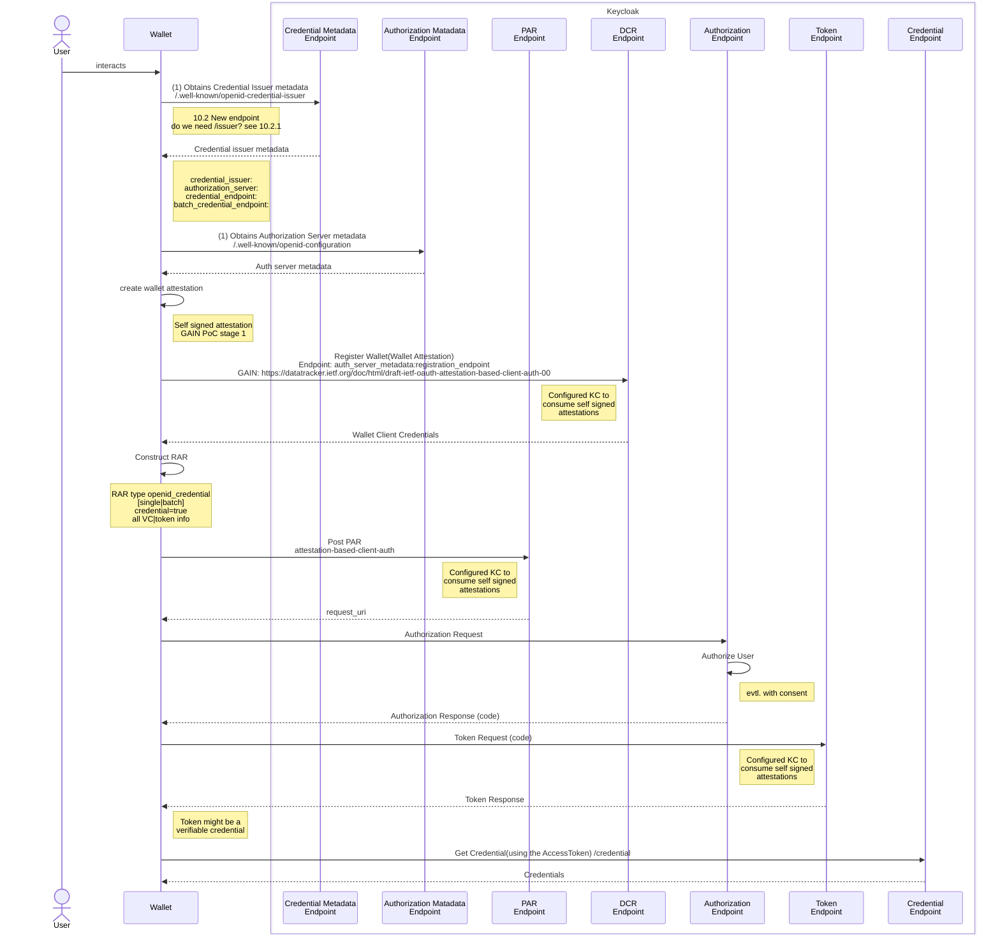

## Step-1-b: Keycloak Issuer - Authorization Code Flow

In this use case, the user's wallet serves as a client, utilizing the OIDC authorization code flow to facilitate user authentication and enable the wallet to request a token from Keycloak's token endpoint. The token provided by Keycloak can then be:

* A typical access token that can subsequently be used by the wallet to obtain the VCs from a separate credential issuer endpoint, or
* The VCs themselves, assuming we agree to configure Keycloak's token endpoint to return a different token format.

The following diagram from [Francis](https://github.com/francis-pouatcha) in the issue [OID4VC#17616](https://github.com/keycloak/keycloak/discussions/17616?sort=new#discussioncomment-7326341) displays components involved in the production of the VCs.

The key element of concern here is the Client Attestation. The Keycloak client registration interface wil have to be extended to support some sort of client attestations, which are consumable both by Keycloak and eventually by external credential issuers that rely on Keycloak for the authentication of the wallet.

From the diagram, we have following resulting todos:

### Credential Issuer Metadata Endpoint

The Credential Issuer Metadata is specified [here](https://openid.net/specs/openid-4-verifiable-credential-issuance-1_0.html#section-10.2.2).

### OAuth 2.0 Authorization Server Metadata

This interface will be extended to add: pre-authorized_grant_anonymous_access_supported=true|false

### Client Registration Endpoint (DCR)

**To-Do**

* [] Missing clear instruction on how to proceed with the registration of the wallet.

### RAR Support

**To-Do**

* [] Need details on how to proceed with RAR

### Attestation Based Client Auth

See: https://datatracker.ietf.org/doc/html/draft-ietf-oauth-attestation-based-client-auth-00

**To-Do**

* [] Design Keycloak extension to support this.

### Credential Endpoint

See [Credential Endpoint](https://vcstuff.github.io/oid4vc-haip-sd-jwt-vc/draft-oid4vc-haip-sd-jwt-vc.html#section-4.4)
