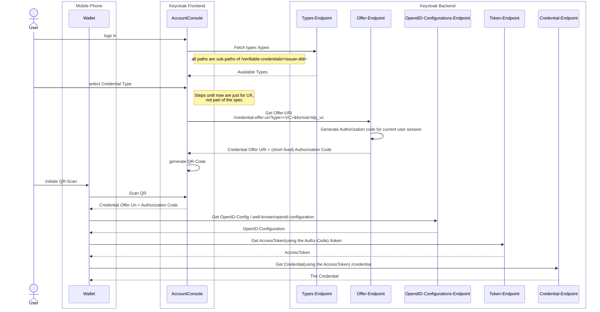

## Step-1-a: Keycloak Issuer - Preauthorize Code Flow
This approach appears to be the simplest, as it doesn't necessitate significant extensions in the Keycloak codebase. The [FIWARE](#fiware) implementation previously mentioned encompasses the majority of the required code. However, this implementation depends on components that are not compatible with keycloak licensing model.

The following diagram from [Stefan](https://github.com/wistefan) in issue [OID4VC#17616](https://github.com/keycloak/keycloak/discussions/17616?sort=new#discussioncomment-7326341) displays components needed for the pre-authorized code flow, as currently implemented in the [FIWARE](#fiware) codebase:

Additional detail from diagram author:

* The flow is using the "Cross-Device Flow"(e.g. Wallet is on a different device than the browser showing the Account Console). 
* Binding the credential to holder-proof is also not yet provided.

As the diagram illustrates, implementation into Keycloak brings following modifications:

### Account Frontend

The modification of the account console to allow for the enrolment of the user wallet.

**To-Do**
* [] Does this lead to the production of any sort of Client Attestation.

### Types Endpoint

**To-Do**

* [] Describe purpose of the Types Endpoint

### Credential Offer Endpoint

See Credential Offer Endpoint in [OID4VCI](https://openid.net/specs/openid-4-verifiable-credential-issuance-1_0.html#section-11.2)

**To-Do**

* [] What type of credential will be natively offered by Keycloak?
* [] Are we planing to provide some sort of generic model based on the current KC user and role data model?
* [] Do we want to design something like a CredentialOfferProvider to allow for plugable credential models?

### OAuth 2.0 Authorization Server Metadata

This interface will be extended to add: pre-authorized_grant_anonymous_access_supported=true|false

### Credential Endpoint.
Whereby it is open to check if it does not make sense to have Token Endpoind directly produce the VC.